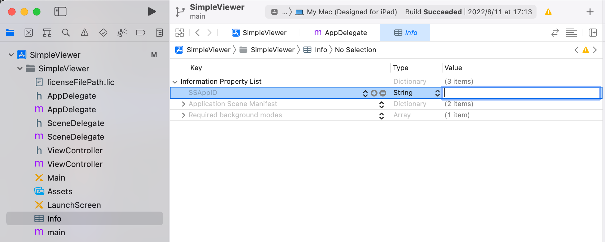
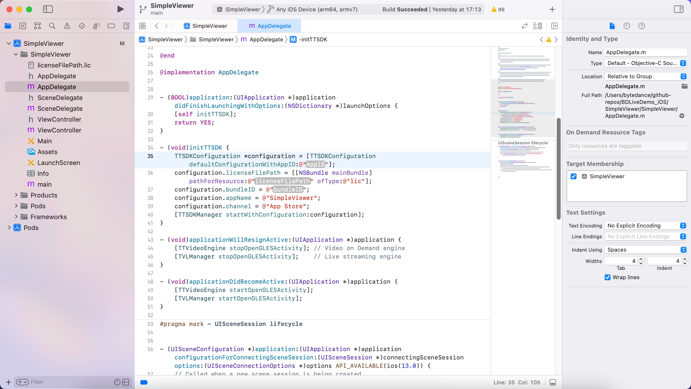
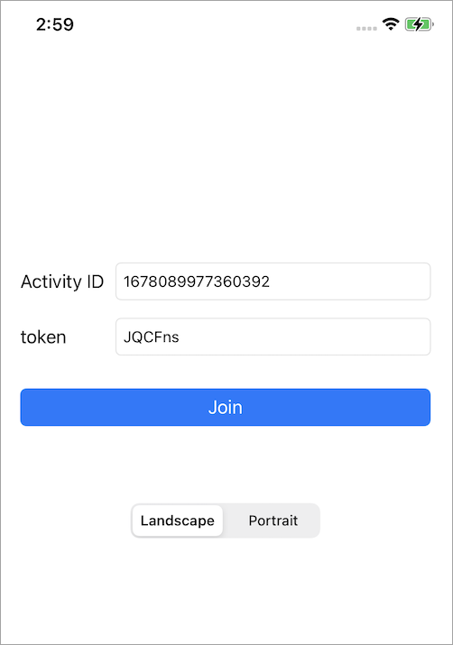

# BDLiveDemo_iOS

企业直播在 GitHub 上提供开源示例项目 BDLiveDemo_iOS 用于演示如何集成和使用观播 SDK。该项目包含以下四个 Demo：

- `SimpleViewer`: 演示了如何通过少量代码接入完整直播间。
- `Player`: 演示了如何接入播放器组件。
- `FloatingPlayer`: 演示了如何接入支持画中画功能的播放器组件。在这个 Demo 中，观众可以不进入直播间页面就查看画中画效果。
- `HybridViewer`: 演示了如何使用观播 SDK 配合您的业务 UI，搭建定制化的直播间。
本文以 SimpleViewer 为例，介绍如何快速编译并运行 Demo。

# 前提条件

- iOS 9.0 及以上版本的真机或模拟器。
- CPU 架构：armv7、arm64、x86_64。
- 安装 Xcode，建议使用最新版本。
- 安装 CocoaPods，建议使用 1.11.0 或更高版本。可参考 [Getting Started with CocoaPods](https://guides.cocoapods.org/using/getting-started.html#getting-started)。
- 联系企业直播技术支持获取 TTSDK License 文件和 AppID。License 是使用 TTSDK 对应模块的鉴权凭证。

# 操作步骤

1. 在终端中运行以下命令，将 BDLiveDemo_iOS 仓库克隆至本地：

```
git clone https://github.com/volcengine/BDLiveDemo_iOS.git
```

2. 进入 BDLiveDemo_iOS/SimpleViewer 文件夹后，安装所需的依赖库。

```
cd BDLiveDemo_iOS/SimpleViewer
pod install
```

> 安装成功后，终端会显示 Pod installation complete!，此时 BDLiveDemo_iOS/SimpleViewer 文件夹下会生成一个 SimpleViewer.xcworkspace 文件。

3. 双击 SimpleViewer.xcworkspace 文件，即可在 Xcode 中打开 SimpleViewer 项目。
4. 在项目 TARGETS 下的 Signing & Capabilities 界面勾选 Automatically manage signing，配置您的 Team 和 Bundle Identifier。
5. 将您获取到的 TTSDK License 文件拷贝至 BDLiveDemo_iOS/SimpleViewer/SimpleViewer 文件夹中。假设 License 文件名为 licenseFilePath.lic，文件结构如下：

```
└── BDLiveDemo_iOS
    ├── SimpleViewer
    │   ├── SimpleViewer
    │   │   ├── licenseFilePath.lic
```

6. 在 SimpleViewer/info.plist 文件中将 SSAppID 的值设为您申请 TTSDK License 文件时使用的 AppID。



7. 在 SimpleViewer/AppDelegate.m 文件中，修改 -initTTSDK 方法的 BundleID、AppID、LicenseFilePath 参数值。

> 💡 说明：  
> 您需要确保以下事项，否则会出现鉴权失败的问题：
> - TTSDK License 文件对应的 BundleID 和 AppID 与初始化 TTSDK SDK 时传入的 BundleID 和 AppID 一致。
> - 初始化 TTSDK 时传入的 BundleID 和项目配置的 Bundle Identifier 一致。



8. 连接上 iOS 设备后，在 iOS 设备下拉框中选中您的 iOS 设备。
9. 单击 Build 图标开始编译项目。编译成功后，您的 iOS 设备上会出现一个名为 SimpleViewer 的应用。
10. 在 iOS 系统设置中将该应用设为信任开发者后，您才能打开应用。打开应用后，您可以看到以下界面。此处预填了企业直播官方 Demo 直播间的 Activity ID 和 token。点击 Join 即可进入直播间。



# 更多文档

[产品动态](https://www.volcengine.com/docs/6669/101243)  
[集成 SDK](https://www.volcengine.com/docs/6669/101259)  
[接口说明](https://www.volcengine.com/docs/6669/122548)  
